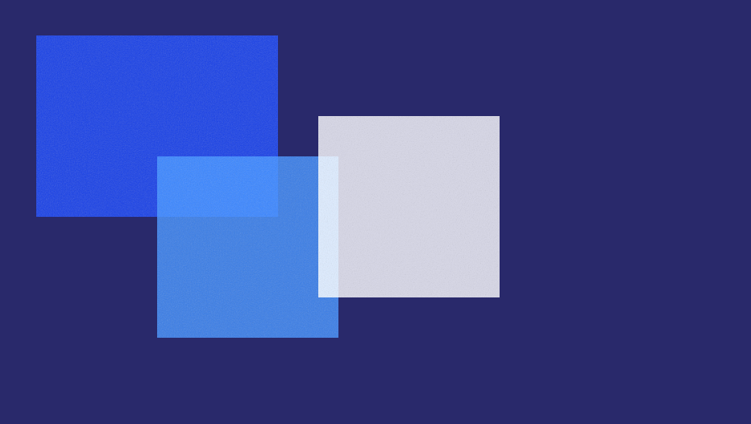
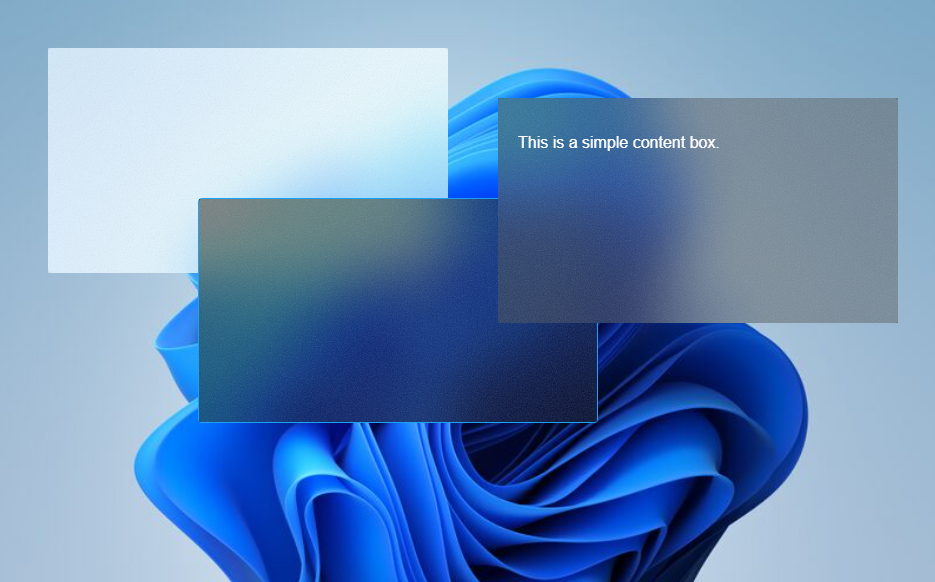

# Acrylic

Acrylic is a project showcasing the implementation of acrylic-style UI components using advanced CSS properties. This repository provides the source code and examples to help you create visually appealing, glass-like effects for modern web applications.

### Prerequisites

To run the Acrylic project, you will need:

- A modern web browser that supports CSS `backdrop-filter` and other advanced CSS properties. This includes:

  | Browser         | Minimum Version |
  | --------------- | --------------- |
  | Google Chrome   | 76 and above    |
  | Mozilla Firefox | 70 and above    |
  | Microsoft Edge  | 79 and above    |
  | Safari          | 13 and above    |

Ensure your browser is up to date to fully experience the acrylic effects.

## Customization

You can customize the acrylic effects by overriding the CSS variables in your own stylesheet. For example:

- `--blur-amount`: Controls the amount of blur.
- `--brightness-amount`: Controls the brightness.
- `--tint-color`: Sets the tint color.
- `--tint-opacity`: Sets the opacity of the tint.

## Screenshots

Here are some screenshots of the acrylic effects in action:

_Example of acrylic boxes with different styles._

_Example of acrylic boxes with content._

## Acknowledgements

- Inspired by Fluent Design System.
- [Acrylic Material - Microsoft Design](https://learn.microsoft.com/en-us/windows/apps/design/style/acrylic)
